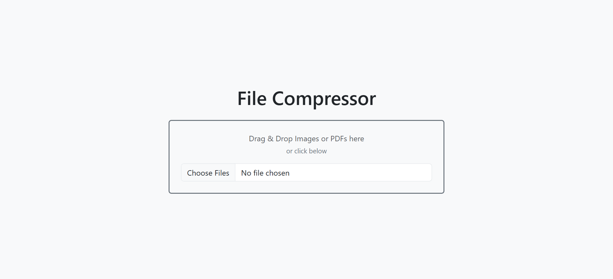

# 📦 File Compressor (React + Bootstrap)

A simple and powerful **file compression tool** built with **React + Vite** and styled using **Bootstrap**.  
This app allows you to **compress images and PDF files**, supports **drag-and-drop uploads**, and even generates a **ZIP file** when multiple files are compressed.

---

## 🚀 Features

✅ **Image Compression** – Uses [`browser-image-compression`](https://www.npmjs.com/package/browser-image-compression) to reduce image size without losing too much quality.  
✅ **PDF Compression** – Uses [`pdf-lib`](https://www.npmjs.com/package/pdf-lib) to re-save and optimize PDFs.  
✅ **Drag & Drop Support** – Drag files directly into the drop zone for quick uploads.  
✅ **Multiple File Support** – Select or drop multiple files at once.  
✅ **ZIP Download** – Uses [`jszip`](https://www.npmjs.com/package/jszip) to bundle multiple compressed files into a single ZIP.  
✅ **Bootstrap Styling** – Clean and responsive design with [Bootstrap](https://getbootstrap.com/).  
✅ **Download Button** – Quickly download compressed files (or ZIP).  

---

## 🛠️ Tech Stack

- **React (Vite)** – Frontend framework
- **Bootstrap** – Styling and layout
- **browser-image-compression** – Image compression library
- **pdf-lib** – PDF optimization
- **jszip** – ZIP file generator

---

## 📦 Installation & Setup

1. **Clone this repository**

```bash
git clone https://github.com/YOUR-USERNAME/file-compressor.git
cd file-compressor
```

2. **Install dependencies**

```bash
npm install
```

3. **Install required libraries**

```bash
npm install bootstrap browser-image-compression pdf-lib jszip
```

4. **Run the development server**

```bash
npm run dev
```

5. **Open in your browser**

Visit `http://localhost:5173` (Vite default port)

---


## 🖼 Preview



---

## 🧩 How It Works

### 🔹 File Input / Drag & Drop
- Handles both file input selection and drag-and-drop events.
- Accepts `image/*` and `application/pdf`.

### 🔹 Image Compression
- Uses `browser-image-compression` with:
  - `maxSizeMB: 1`
  - `maxWidthOrHeight: 1200`
  - `useWebWorker: true`

### 🔹 PDF Compression
- Uses `pdf-lib` to load the document and re-save it with object streams enabled.

### 🔹 Multiple Files → ZIP
- When multiple files are uploaded, they are compressed and then packaged into a `.zip` file using `jszip`.

---

## 🎨 Styling

This project uses **Bootstrap 5** for:
- Grid & layout (`container`, `d-flex`, `justify-content-center`, `align-items-center`, `vh-100`)
- Form elements (`form-control`, `btn`, `card`, `alert`)
- Borders, spacing, and typography.

---

## 🤝 Contributing

Feel free to **fork** this repo, open issues, and submit pull requests.  
This project is open-source and free to use for learning or production.

---

## 📜 License

This project is released under the **MIT License**.  
You are free to use, modify, and distribute it.
